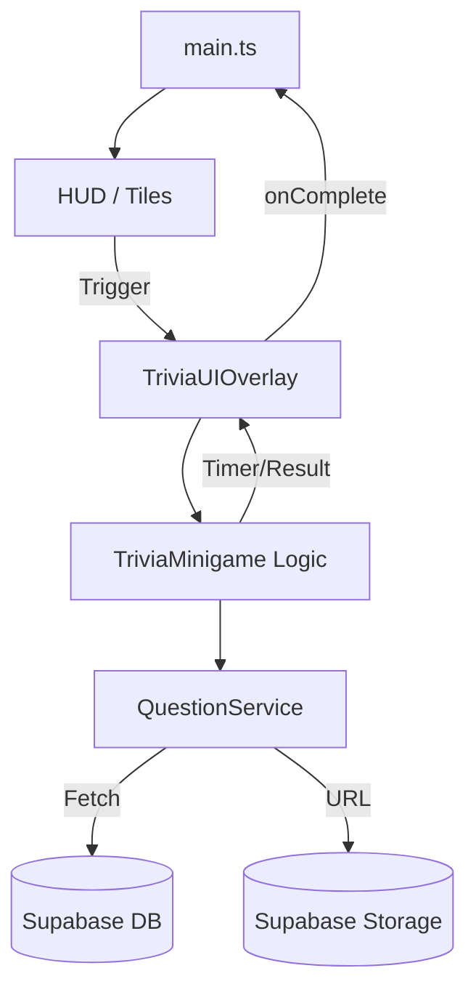
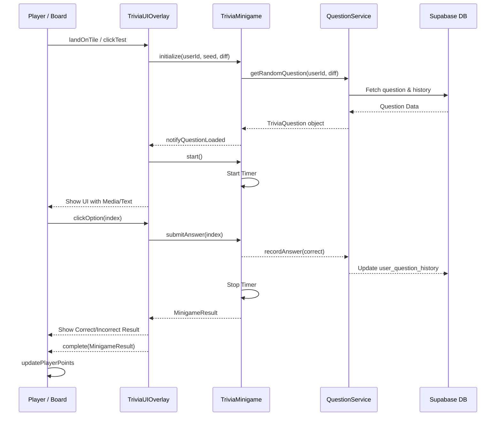

# Majlis Game - Minigame System Developer Guide

This document provides a comprehensive overview of the minigame system integrated with Supabase, covering architecture, database schema, UI implementation, and testing procedures.

## 1. Architecture Overview

The minigame system follows a modular, factory-based architecture designed for scalability and loose coupling.

### System Diagram


### Flow Sequence


## 2. Component Breakdown

### Core Services (`src/minigames/core/`)
-   **`supabase-client.ts`**: Initializes the Supabase client using environment variables. Includes utility to check configuration status.
-   **`question-service.ts`**: The main business logic layer.
    -   Handles fetching random questions based on user status (Trial vs. Paid).
    -   Interfaces with Supabase database and generates public URLs for media.
    -   Records question history to prevent repetition.
-   **`types.ts`**: Defines standard interfaces (`IMinigame`, `TriviaQuestion`, `MinigameResult`) and constants for difficulty-based points and time limits.

### Minigame Implementations (`src/minigames/games/`)
-   **`trivia-minigame.ts`**: Pure logic class for trivia. Manages the state of a single question session, including timers and answer validation.

### UI Layer (`src/ui/`)
-   **`trivia-overlay.ts`**: High-fidelity Arabic UI.
    -   Supports Right-to-Left (RTL) layout.
    -   Handles multimedia playback (Audio/Video).
    -   Responsive design with animations and countdown bars.
    -   **`TriviaUIOverlayDirect`**: A specialized test class for direct question injection (bypassing randomization for testing).

## 3. Data Model & Supabase Setup

### Database Tables
1.  **`categories`**: Groupings for questions (Science, History, etc.).
2.  **`questions`**: The main store and question pool.
    -   `type`: 'text', 'audio', or 'video'.
    -   `media_path`: Relative path in the storage bucket.
    -   `is_trial`: Boolean to mark free-to-play content.
3.  **`user_question_history`**: Tracks which users have seen which questions.
4.  **`users`**: Stores user profiles and `is_paid` flag.

### Storage Buckets
-   **`trivia-media`**: Public bucket for hosting MP3 and MP4 files. 
    -   Structure: `/Audio/file.mp3`, `/Video/file.mp4`.

## 4. Environment Configuration

Create a `.env` file in the project root:
```env
VITE_SUPABASE_URL=https://your-project.supabase.co
VITE_SUPABASE_ANON_KEY=your-public-anon-key
```
> [!IMPORTANT]
> Always use the **Anon Public Key** for the frontend. The Service Role key must never be exposed in the browser.

## 5. Technical Implementation Details

For developers looking to extend or debug the system, here are the core code snippets and patterns used.

### Core Interface: `IMinigame`
All minigames must implement this interface to ensure compatibility with the game scene and HUD.
```typescript
export interface IMinigame {
    id: string;
    type: 'trivia' | 'interactive';
    initialize(userId?: string, gameSeed?: string, difficulty?: Difficulty): Promise<void>;
    start(): void;
    end(): MinigameResult;
    onComplete: (result: MinigameResult) => void;
}
```

### Data Structure: `TriviaQuestion`
Questions are mapped from Supabase rows to this frontend structure.
```typescript
export interface TriviaQuestion {
    id: string;
    categoryId: string;
    type: 'text' | 'audio' | 'video';
    difficulty: Difficulty;
    questionAr: string;
    options: string[];
    correctAnswer: number;
    points: number;
    mediaUrl?: string; // Resolved from media_path
}
```

### Supabase Query Pattern
Fetching a random question that the user hasn't seen before:
```typescript
const { data, error } = await supabase
    .from('questions')
    .select('*')
    .eq('difficulty', difficulty)
    .not('id', 'in', `(${seenIds.join(',')})`) // Exclude history
    .eq('is_trial', !isPaid)
    .limit(1)
    .single();
```

## 6. Developer Testing Tools

We have integrated specialized testing functionality to verify Supabase content without playing the full game:

### Test Button (HUD)
A test button (❓) is available in the HUD. It cycles through question types fetched directly from Supabase:
1.  **First Click**: Random Text question.
2.  **Second Click**: Random Audio question (verifies playback).
3.  **Third Click**: Random Video question.

### Implementation Code
```typescript
// main.ts - Cycle testing
private handleTestTrivia(): void {
    const type = this.questionTypes[this.index];
    showTriviaByType(type, (result) => {
        if (result.success) this.hud.showTileMessage('win', result.points);
        this.updateUI();
    });
}
```

## 6. Known Troubleshooting

-   **Media Not Playing**: Check the browser console. If it shows 400/404, verify the `media_path` in the database matches the file path in Storage exactly (case-sensitive).
-   **Supabase Not Configured**: Ensure `.env` exists and the Vite dev server was restarted after creation.
-   **Space in URLs**: Supabase public URLs encode spaces as `%20`. Ensure files are uploaded without special characters if possible for better compatibility.

---
*Last updated: February 10, 2026*
